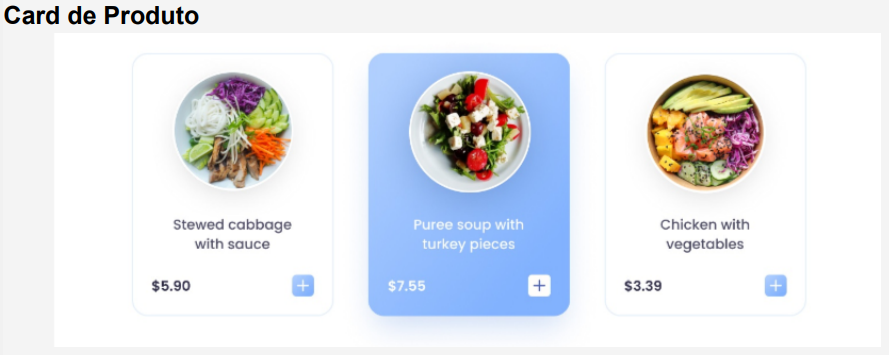
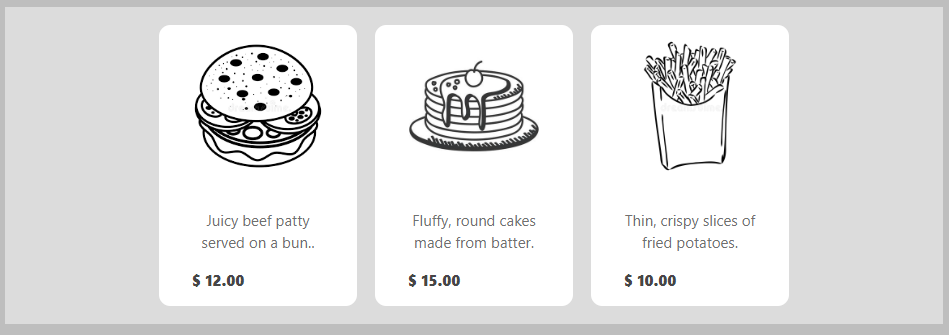

# SENAC - Produção Textual Individual

## Criação de Componentes Funcionais

Considere um cenário onde uma rede de Fast Food pretende incrementar as
vendas através da adoção de um aplicativo próprio de delivery. A equipe de
desenvolvimento iniciou a análise do sistema e projetou toda a arquitetura da
aplicação. Cada membro da equipe ficou responsável pela criação de um
componente do app. Os designers da empresa prototiparam a interface, conforme
imagem apresentada..

Baseado na descrição do texto base, escolha e crie um componente funcional em
React JS:

## Resultado final

 
Componente criado executado no celular:

